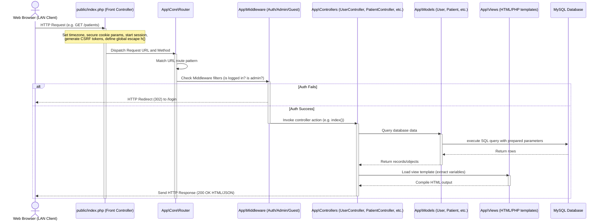

# System Architecture Guide - Barangay Sinalhan Health Center

This document outlines the software architecture, class organization, request lifecycle, and local network (LAN) deployment architecture for the **Patient Management System** of the Barangay Sinalhan Health Center.

---

## 1. Architectural Overview

The system is built on a custom, lightweight **Model-View-Controller (MVC)** framework written in PHP 8.2+. It is designed specifically to run inside a local area network (LAN) using a local XAMPP stack on a Windows machine.

### Key Architectural Constraints
* **Framework-Free**: Avoids complex external frameworks (like Laravel or Symfony) to prevent deployment and compilation overhead on LAN workstations, making it easier to audit and defend during the capstone review.
* **Zero CDN Dependency**: All styling, script assets, and libraries are stored locally in the public folder to ensure uninterrupted operation during internet outages.
* **Thin Controllers / Thick Models**: Business and database validations, auto-number generation, and direct SQL parameter binding are placed in Models, keeping Controllers focused on request routing and output delegation.

---

## 2. Request-Response Lifecycle

The request flow utilizes a centralized **Front Controller** pattern where all client browser requests are processed through a single entry point:



---

## 3. Core Classes & Helpers

The custom MVC engine is located inside the `app/Core/` directory.

### 3.1 Autoloader (`app/Core/Autoloader.php`)
Resolves PHP classes dynamically by mapping namespaces directly to folder directories using PSR-4 standards:
* Namespace `App\` maps to the `app/` folder.
* Classes are loaded on demand, avoiding slow global requires.

### 3.2 Database Wrapper (`app/Core/Database.php`)
Implemented as a thread-safe **Singleton Pattern** that wraps the PDO instance:
* `Database::getInstance()` retrieves the active singleton wrapper.
* `.getConnection()` exposes the unified PDO channel configured with strict attributes:
  * `PDO::ATTR_ERRMODE => PDO::ERRMODE_EXCEPTION` (throws exceptions for SQL errors).
  * `PDO::ATTR_DEFAULT_FETCH_MODE => PDO::FETCH_ASSOC` (returns associative arrays).
  * `PDO::ATTR_EMULATE_PREPARES => false` (forces native MySQL prepared statements).

### 3.3 Core Router (`app/Core/Router.php`)
Maintains a routing dictionary registering request verbs (`GET`, `POST`) and URL patterns using regular expressions.
* Handles wildcards (e.g. `/patients/{id}` converts to `/patients/(\d+)`).
* Captures route parameters and passes them dynamically to controller action parameters.

### 3.4 Base Controller (`app/Core/Controller.php`)
Provides shared utility functions for sub-controllers:
* `view($name, $data)`: Extracts variables and requires view template files securely.
* `redirect($url)`: Prepends base folder subdirectories dynamically.
* `json($data, $statusCode)`: Formats and outputs HTTP JSON payloads.

### 3.5 Global Error & Exception Handler (`app/Core/ErrorHandler.php`)
Intercepts uncaught PHP exceptions, runtime errors, and fatal shutdown events:
* **Global Handlers**: Registers `set_exception_handler`, `set_error_handler`, and `register_shutdown_function` in `public/index.php`.
* **Structured Disk Logging**: Automatically appends crash details (timestamp, IP, URI, User ID, Exception type, file line number, and stack trace) to `storage/logs/error.log`.
* **Audit Trail Integration**: Logs a `SYSTEM_ERROR` event to `audit_logs` if database connectivity remains active.
* **User Experience & 500 View**: Cleans output buffers (`ob_end_clean()`) and renders a clean `app/Views/errors/500.php` page instead of a raw code stack trace or blank screen.
* **Configurable Debug Mode**: Configured via `'debug'` in `config/app.php` (toggles technical stack traces on screen during development vs clean error messages for LAN deployment).

---

## 4. Middleware & Hooks

Operational security and route protection are executed through middleware checks triggered by the Router during dispatch:

1. **GuestMiddleware**: Restricts access to `/login` for users who are already logged in, redirecting them straight to the `/dashboard`.
2. **AuthMiddleware**: Intercepts active checks to verify if `$_SESSION['user_id']` exists. If not, it redirects the request to `/login` with an warning message.
3. **AdminMiddleware**: Validates that `$_SESSION['user_role'] === 'admin'`. If standard staff members attempt to access admin routes (like `/users`, `/backup`, `/audit-logs`, `/archive/patients`), they are returned to `/dashboard` with an unauthorized alert.
4. **Password Reset Interceptor**: Executed during authentication check. If a user's record has `must_change_password = 1`, all requests (except `/change-password` and `/logout`) redirect them immediately to the `/change-password` template to secure their account.

---

## 5. Local Area Network (LAN) Deployment Architecture

The application runs inside a local area network to prevent internet dependency:

```text
                                  +---------------------------------------+
                                  |         Windows Local Server          |
                                  |               (XAMPP)                 |
                                  |  [Apache 2.4]  <--->  [MySQL 8.0]     |
                                  |  IP: 192.168.1.100                    |
                                  +-------------------+-------------------+
                                                      |
                             +------------------------+------------------------+
                             | LAN Router / Switch                             |
                             +------------------------+------------------------+
                                                      |
             +----------------------------------------+----------------------------------------+
             |                                        |                                        |
             v                                        v                                        v
+-------------------------+              +-------------------------+              +-------------------------+
|    Records Workstation  |              |    Nurse Workstation    |              |   Doctor Workstation    |
|   Client (192.168.1.11) |              |  Client (192.168.1.12)  |              |  Client (192.168.1.13)  |
|   Browser -> Patients   |              |   Browser -> Vitals     |              |  Browser -> Consults    |
+-------------------------+              +-------------------------+              +-------------------------+
```

### 5.1 Apache Virtual Host Configuration (`httpd-vhosts.conf`)
To host the system locally so other LAN workstations can connect, the host machine binds the project public folder as follows:

```apache
<VirtualHost *:80>
    DocumentRoot "C:/xampp/htdocs/sinalhan-hc-system/public"
    ServerName sinalhan-hc.local
    
    <Directory "C:/xampp/htdocs/sinalhan-hc-system/public">
        Options Indexes FollowSymLinks
        AllowOverride All
        Require all granted
    </Directory>
</VirtualHost>
```

### 5.2 Server Address Binding (`httpd.conf`)
Ensure Apache listens on all network interfaces:
```apache
Listen 80
```
LAN workstations access the system using the server host's local IP (e.g., `http://192.168.1.100/sinalhan-hc-system/public` or custom local hosts DNS names mapped in the router/clients hosts files).

---

## 6. Clinical Workstation & Subsystem Architecture

The system coordinates specialized clinical modules through standardized architectural patterns:

### 6.1 Two-Stage Progressive Intake Architecture
To prevent waiting room bottlenecks while maintaining comprehensive clinical depth:
* **Stage 1: Fast Front-Desk Registration (`/patients/create`)**: Captures only essential identity, household (`family_no`), and PhilHealth categorization in 60–90 seconds.
* **Stage 2: Modular Clinical Workstation (`/patients/{id}`)**: Enriches records progressively across 8 specialized, non-intrusive workstation tabs:
  1. **Overview**: Vital signs snapshot, household family links, and medical condition summary.
  2. **IHP History**: PhilHealth Annex A1 Individual Health Profile checklist, surgical logs, and habits.
  3. **Consultations**: SOAP clinical notes with linked vitals and asynchronous modal viewers.
  4. **Vitals Log**: Chronological blood pressure, pulse, temperature, and BMI trends.
  5. **Immunizations**: Universal child and adult vaccination matrix with batch logs.
  6. **Maternal Care (Female)**: Gestational tracker, Naegele EDC, dynamic AOG, serial follow-up checkups, and past deliveries matrix.
  7. **Well Baby Care (Infants/Children 0–5y)**: Birth context, DOH EPI immunization tracker, Vitamin A/Deworming, and monthly growth logs.
  8. **Appointments & Queue**: History of scheduled visits and clinic wait times.

### 6.2 Clinical Decision Support (CDS) & Safety Alerts
Real-time safety triggers scan patient profiles and render visual warning banners:
* **Allergy Warnings**: Scans IHP history and highlights active allergies across the master profile and consultation creation forms.
* **Pre-Eclampsia Alert**: Automatically flags pregnant patients with elevated BP or history of pregnancy-induced hypertension.
* **Chronic Disease Banners**: Highlights patients with diagnosed Hypertension, Diabetes, or Asthma during SOAP checkups.
* **Vital Signs Color Triage**: Automatically flags fever ($\ge 37.8^\circ\text{C}$), hypothermia ($< 35.0^\circ\text{C}$), hypertension ($\ge 140/90\text{ mmHg}$), hypotension ($< 90/60\text{ mmHg}$), and hypoxia ($SpO_2 < 95\%$).

### 6.3 Clinical Calculators & Algorithms
* **Naegele's Rule**: Computes Estimated Date of Confinement: $\text{EDC} = \text{LMP} + 1\text{ year} - 3\text{ months} + 7\text{ days}$.
* **Dynamic Age of Gestation (AOG)**: Computes live gestational progress in exact weeks and days from LMP to the current date.
* **Metric Body Mass Index (BMI)**: Computes $\text{BMI} = \frac{\text{Weight (kg)}}{(\text{Height (m)})^2}$ with WHO category mapping.

### 6.4 Cross-Module Service Integration
Clinical program tagging (`General OPD`, `Prenatal Care`, `Well Baby Immunization`, `Senior Care`) synchronizes:
* **Queue Management**: Service-specific queue routing and lobby monitor display.
* **Appointments**: Program-tagged scheduling with clinical purpose selection.
* **Reporting Engine**: DOH-compliant Maternal Health Registry, Child EPI Coverage Report, and Morbidity Registry.
* **Database Backup Engine**: Complete `.sql` snapshots including all 18 clinical, demographic, and administrative tables.

