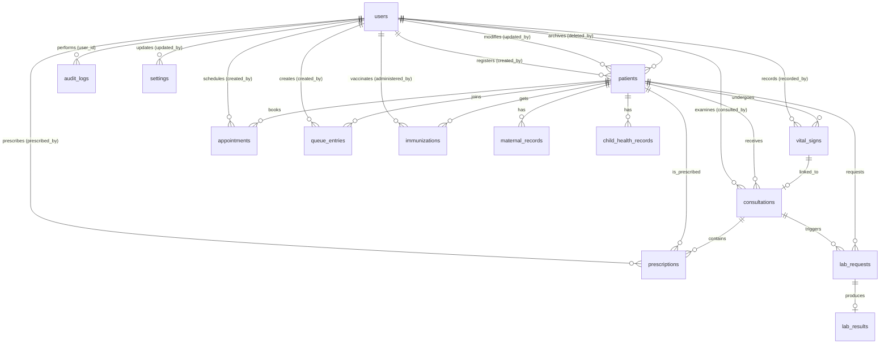

# SQL Database Design - Barangay Sinalhan Health Center

This document outlines the database design and schema specifications for the **Patient Management System** of the Barangay Sinalhan Health Center.

The database is built on **MySQL 8.0** using the **InnoDB storage engine** to support referential integrity, transaction safety, and crash recovery. It is designed to run locally under XAMPP.

---

## 1. Database Architecture Principles

To ensure data integrity, speed, and security in a multi-user local area network (LAN) environment, the database follows these design principles:

1. **Referential Integrity**: To prevent accidental deletion of critical clinical logs, all patient-related foreign keys use `ON DELETE RESTRICT`. Patient records are archived rather than physically deleted.
2. **Indexing Strategy**: Secondary indexes are added to columns frequently used in `WHERE`, `JOIN`, `ORDER BY`, or search clauses (e.g., patient numbers, names, dates, and status fields).
3. **Audit Trail**: Tracking fields (`created_at`, `updated_at`, `created_by`, `updated_by`) are implemented on operational records. An independent `audit_logs` table records sensitive actions.
4. **Soft Deletes (Archiving)**: Patient and clinical records are never permanently deleted from the active interface. Instead, archiving is handled via soft-delete columns (`deleted_at`, `deleted_by`, `archive_reason`).
5. **Data Isolation & Security**: Passwords are saved as secure bcrypt hashes. A `must_change_password` flag is applied to default accounts to force user password updates on first login.
6. **Consistent Naming**: All table names are lowercase and plural (e.g., `patients`, `vital_signs`). Column names are snake_case.

---

## 2. Entity-Relationship Diagram (ERD)

The following Mermaid diagram shows the relationships between the core database tables:



---

## 3. Data Dictionary

### 3.1 `users` Table
Stores login credentials, system roles, and profile information for health center staff.

| Column Name | Data Type | Constraints | Default | Description |
| :--- | :--- | :--- | :--- | :--- |
| `id` | INT | PRIMARY KEY, AUTO_INCREMENT | | Unique internal identifier for the user. |
| `username` | VARCHAR(50) | UNIQUE, NOT NULL | | Login username. |
| `password_hash` | VARCHAR(255) | NOT NULL | | Bcrypt hash of the user password. |
| `role` | ENUM('admin', 'staff') | NOT NULL | | Determines access privileges. |
| `first_name` | VARCHAR(50) | NOT NULL | | User's first name. |
| `middle_name` | VARCHAR(50) | | NULL | User's middle name. |
| `last_name` | VARCHAR(50) | NOT NULL | | User's last name. |
| `email` | VARCHAR(100) | UNIQUE | NULL | User's professional email address. |
| `contact_no` | VARCHAR(20) | | NULL | User's contact/phone number. |
| `job_title` | VARCHAR(50) | | NULL | E.g., 'Nurse', 'Midwife', 'BHW', 'Records Officer'. |
| `status` | ENUM('active', 'inactive') | NOT NULL | 'active' | Active status determines login authorization. |
| `must_change_password`| TINYINT(1) | NOT NULL | 1 | Flag (1/0) forcing password change upon first login. |
| `created_at` | TIMESTAMP | NOT NULL | CURRENT_TIMESTAMP | Record creation timestamp. |
| `updated_at` | TIMESTAMP | NOT NULL | CURRENT_TIMESTAMP* | Record modification timestamp. |

\* *Automatic update on row modification (`ON UPDATE CURRENT_TIMESTAMP`)*

---

### 3.2 `patients` Table
Stores demographics and profiles. Patient files can be soft-deleted (archived) instead of permanently deleted.

| Column Name | Data Type | Constraints | Default | Description |
| :--- | :--- | :--- | :--- | :--- |
| `id` | INT | PRIMARY KEY, AUTO_INCREMENT | | Unique internal identifier for the patient. |
| `patient_no` | VARCHAR(20) | UNIQUE, NOT NULL | | Human-readable ID (e.g., `P-YYYY-XXXXX`). |
| `first_name` | VARCHAR(50) | NOT NULL | | Patient's first name. |
| `middle_name` | VARCHAR(50) | | NULL | Patient's middle name. |
| `last_name` | VARCHAR(50) | NOT NULL | | Patient's last name. |
| `dob` | DATE | NOT NULL | | Patient's date of birth. |
| `sex` | ENUM('Male', 'Female') | NOT NULL | | Patient's biological sex. |
| `civil_status` | ENUM('Single', 'Married', 'Widowed', 'Divorced', 'Separated') | NOT NULL | | Patient's marital status. |
| `contact_no` | VARCHAR(20) | | NULL | Patient's primary phone number. |
| `barangay` | VARCHAR(100) | NOT NULL | 'Sinalhan' | Resident barangay. |
| `address` | TEXT | NOT NULL | | Complete street address. |
| `emergency_name` | VARCHAR(100) | | NULL | Contact person in case of emergency. |
| `emergency_no` | VARCHAR(20) | | NULL | Phone number of emergency contact. |
| `philhealth_no` | VARCHAR(20) | UNIQUE | NULL | PhilHealth ID number. |
| `deleted_at` | TIMESTAMP | | NULL | Timestamp when patient was archived (NULL if active). |
| `deleted_by` | INT | FK (`users.id`), NULL | NULL | Admin user who archived the record. |
| `archive_reason` | TEXT | | NULL | Explanation for archiving the record. |
| `created_by` | INT | FK (`users.id`), NOT NULL | | User who registered the patient. |
| `updated_by` | INT | FK (`users.id`), NULL | NULL | User who last updated the profile. |
| `created_at` | TIMESTAMP | NOT NULL | CURRENT_TIMESTAMP | Record creation timestamp. |
| `updated_at` | TIMESTAMP | NOT NULL | CURRENT_TIMESTAMP* | Record modification timestamp. |

---

### 3.3 `vital_signs` Table
Records patient vitals. Multiple sets of vitals may exist for a patient over multiple clinic visits.

| Column Name | Data Type | Constraints | Default | Description |
| :--- | :--- | :--- | :--- | :--- |
| `id` | INT | PRIMARY KEY, AUTO_INCREMENT | | Unique vital signs record identifier. |
| `patient_id` | INT | FK (`patients.id`) ON DELETE RESTRICT | | Patient linked to these vitals. |
| `bp_systolic` | INT | | NULL | Blood pressure - Systolic (mmHg). |
| `bp_diastolic` | INT | | NULL | Blood pressure - Diastolic (mmHg). |
| `heart_rate` | INT | | NULL | Pulse/Heart rate (bpm). |
| `respiratory_rate`| INT | | NULL | Respiration rate (breaths/min). |
| `temperature` | DECIMAL(4,2) | | NULL | Body temperature in Celsius. |
| `weight` | DECIMAL(5,2) | | NULL | Weight in kilograms (kg). |
| `height` | DECIMAL(5,2) | | NULL | Height in centimeters (cm). |
| `bmi` | DECIMAL(4,2) | | NULL | Body Mass Index (kg/m2), auto-calculated. |
| `oxygen_saturation`| INT | | NULL | Blood oxygen saturation SpO2 (%). |
| `notes` | TEXT | | NULL | Observations or complaints about vitals. |
| `recorded_by` | INT | FK (`users.id`), NOT NULL | | Staff member who took the vital signs. |
| `recorded_at` | TIMESTAMP | NOT NULL | CURRENT_TIMESTAMP | Date and time recorded. |

---

### 3.4 `consultations` Table
Main clinic documentation logs using the SOAP (Subjective, Objective, Assessment, Plan) format.

| Column Name | Data Type | Constraints | Default | Description |
| :--- | :--- | :--- | :--- | :--- |
| `id` | INT | PRIMARY KEY, AUTO_INCREMENT | | Unique consultation record identifier. |
| `patient_id` | INT | FK (`patients.id`) ON DELETE RESTRICT | | Patient who had the consultation. |
| `vital_signs_id` | INT | FK (`vital_signs.id`) ON DELETE SET NULL | NULL | Associated vitals captured during this visit. |
| `subjective` | TEXT | NOT NULL | | Patient complaints and subjective history. |
| `objective` | TEXT | NOT NULL | | Physical findings and objective assessments. |
| `assessment` | TEXT | NOT NULL | | Diagnosis, clinical impression, or ICD code description. |
| `plan` | TEXT | NOT NULL | | Treatment, prescriptions, medical advice, and tests. |
| `status` | ENUM('Open', 'Completed', 'Cancelled') | NOT NULL | 'Completed' | Status of the consultation record. |
| `consulted_by` | INT | FK (`users.id`), NOT NULL | | Doctor or healthcare worker conducting the checkup. |
| `consulted_at` | TIMESTAMP | NOT NULL | CURRENT_TIMESTAMP | Timestamp of the consultation. |
| `created_by` | INT | FK (`users.id`), NOT NULL | | User who recorded the entry. |
| `updated_by` | INT | FK (`users.id`), NULL | NULL | User who last updated the entry. |
| `created_at` | TIMESTAMP | NOT NULL | CURRENT_TIMESTAMP | Creation timestamp. |
| `updated_at` | TIMESTAMP | NOT NULL | CURRENT_TIMESTAMP* | Modification timestamp. |
| `deleted_at` | TIMESTAMP | | NULL | Soft delete/archived timestamp. |
| `deleted_by` | INT | FK (`users.id`), NULL | NULL | User who archived the record. |
| `archive_reason` | TEXT | | NULL | Reason why this consultation record was soft-deleted. |

---

### 3.5 `appointments` Table
Manages future schedules and follow-up patient visits.

| Column Name | Data Type | Constraints | Default | Description |
| :--- | :--- | :--- | :--- | :--- |
| `id` | INT | PRIMARY KEY, AUTO_INCREMENT | | Unique appointment identifier. |
| `patient_id` | INT | FK (`patients.id`) ON DELETE RESTRICT | | Patient booked for the appointment. |
| `appointment_date`| DATE | NOT NULL | | Scheduled date. |
| `appointment_time`| TIME | NOT NULL | | Scheduled time. |
| `purpose` | VARCHAR(255) | NOT NULL | | Goal (e.g., 'Prenatal', 'Follow-up', 'Vaccination'). |
| `status` | ENUM('Scheduled', 'Completed', 'Cancelled', 'Missed') | NOT NULL | 'Scheduled' | Booking status. |
| `notes` | TEXT | | NULL | Additional instructions or remarks. |
| `created_by` | INT | FK (`users.id`), NOT NULL | | Staff member who scheduled the appointment. |
| `updated_by` | INT | FK (`users.id`), NULL | NULL | Staff member who modified the booking. |
| `created_at` | TIMESTAMP | NOT NULL | CURRENT_TIMESTAMP | Creation timestamp. |
| `updated_at` | TIMESTAMP | NOT NULL | CURRENT_TIMESTAMP* | Modification timestamp. |

---

### 3.6 `queue_entries` Table
Tracks patient routing, status, and processing times for the day's clinic queue.

| Column Name | Data Type | Constraints | Default | Description |
| :--- | :--- | :--- | :--- | :--- |
| `id` | INT | PRIMARY KEY, AUTO_INCREMENT | | Unique queue entry identifier. |
| `patient_id` | INT | FK (`patients.id`) ON DELETE RESTRICT | | Patient currently in queue. |
| `queue_date` | DATE | NOT NULL | | Date of queue allocation. |
| `queue_no` | INT | NOT NULL | | Daily queue number (resets daily from 1). |
| `status` | ENUM('Waiting', 'Called', 'Serving', 'Completed', 'Cancelled') | NOT NULL | 'Waiting' | Current location in queue process. |
| `time_in` | TIME | NOT NULL | | Clock-in time. |
| `time_called` | TIME | | NULL | Clock time when patient was called. |
| `time_completed` | TIME | | NULL | Clock time when consultation concluded. |
| `created_by` | INT | FK (`users.id`), NOT NULL | | Staff who queued the patient. |
| `updated_by` | INT | FK (`users.id`), NULL | NULL | Staff who updated queue status. |
| `created_at` | TIMESTAMP | NOT NULL | CURRENT_TIMESTAMP | Creation timestamp. |
| `updated_at` | TIMESTAMP | NOT NULL | CURRENT_TIMESTAMP* | Modification timestamp. |

---

### 3.7 `prescriptions` Table *(Supporting Feature)*
Prescription details associated with a specific consultation.

| Column Name | Data Type | Constraints | Default | Description |
| :--- | :--- | :--- | :--- | :--- |
| `id` | INT | PRIMARY KEY, AUTO_INCREMENT | | Unique prescription identifier. |
| `consultation_id` | INT | FK (`consultations.id`) ON DELETE CASCADE | | Linked clinical consultation. |
| `patient_id` | INT | FK (`patients.id`) ON DELETE RESTRICT | | Patient getting the prescription. |
| `medicine_name` | VARCHAR(150) | NOT NULL | | Drug name / Brand / Generic. |
| `dosage` | VARCHAR(50) | NOT NULL | | Strength (e.g., '500 mg', '5 ml / 120 mg'). |
| `frequency` | VARCHAR(50) | NOT NULL | | E.g., 'Three times a day (TID)', 'Every 8 hours'. |
| `duration` | VARCHAR(50) | NOT NULL | | E.g., '7 days', '1 week'. |
| `instructions` | TEXT | | NULL | E.g., 'Take after meals', 'Take on empty stomach'. |
| `prescribed_by` | INT | FK (`users.id`), NOT NULL | | Doctor who prescribed the medicine. |
| `prescribed_at` | TIMESTAMP | NOT NULL | CURRENT_TIMESTAMP | Timestamp when generated. |
| `created_at` | TIMESTAMP | NOT NULL | CURRENT_TIMESTAMP | Record creation timestamp. |
| `updated_at` | TIMESTAMP | NOT NULL | CURRENT_TIMESTAMP* | Record modification timestamp. |

---

### 3.8 `immunizations` Table *(Supporting Feature)*
Records childhood or adult immunizations administered at the health center.

| Column Name | Data Type | Constraints | Default | Description |
| :--- | :--- | :--- | :--- | :--- |
| `id` | INT | PRIMARY KEY, AUTO_INCREMENT | | Unique immunization identifier. |
| `patient_id` | INT | FK (`patients.id`) ON DELETE RESTRICT | | Patient receiving the vaccine. |
| `vaccine_name` | VARCHAR(100) | NOT NULL | | Vaccine code/name (e.g., 'BCG', 'HepB', 'Pentavalent'). |
| `dose_number` | INT | NOT NULL | 1 | Dose sequence (e.g., 1 for 1st dose, 2 for booster). |
| `administered_date`| DATE | NOT NULL | | Vaccination date. |
| `remarks` | TEXT | | NULL | Batch numbers, manufacturer, reactions, etc. |
| `administered_by` | INT | FK (`users.id`), NOT NULL | | Clinician who gave the injection. |
| `created_at` | TIMESTAMP | NOT NULL | CURRENT_TIMESTAMP | Record creation timestamp. |
| `updated_at` | TIMESTAMP | NOT NULL | CURRENT_TIMESTAMP* | Record modification timestamp. |

---

### 3.9 `audit_logs` Table
A security ledger recording updates, deletions, access changes, and administrative actions.

| Column Name | Data Type | Constraints | Default | Description |
| :--- | :--- | :--- | :--- | :--- |
| `id` | INT | PRIMARY KEY, AUTO_INCREMENT | | Unique log entry identifier. |
| `user_id` | INT | FK (`users.id`) ON DELETE SET NULL | NULL | User who executed the action (NULL if guest/system). |
| `username` | VARCHAR(50) | | NULL | Denormalized username for historical traceability. |
| `action` | VARCHAR(100) | NOT NULL | | Action label (e.g. 'PATIENT_ARCHIVED', 'LOGIN_FAILED'). |
| `module` | VARCHAR(50) | NOT NULL | | Impacted module (e.g., 'Auth', 'Queue', 'Backup'). |
| `ip_address` | VARCHAR(45) | NOT NULL | | LAN Client IP address. |
| `user_agent` | TEXT | | NULL | Client web browser details. |
| `details` | TEXT | | NULL | Verbose detail logs or JSON state change diffs. |
| `created_at` | TIMESTAMP | NOT NULL | CURRENT_TIMESTAMP | Occurrence timestamp. |

---

### 3.10 `settings` Table
Key-value configuration items (e.g., Health center name, operating hours, public screen options).

| Column Name | Data Type | Constraints | Default | Description |
| :--- | :--- | :--- | :--- | :--- |
| `setting_key` | VARCHAR(50) | PRIMARY KEY | | Configuration identifier name. |
| `setting_value` | TEXT | | NULL | Value of config item. |
| `description` | VARCHAR(255) | | NULL | Explanatory note of what the key manages. |
| `updated_by` | INT | FK (`users.id`) ON DELETE SET NULL | NULL | Admin who changed the setting. |
| `updated_at` | TIMESTAMP | NOT NULL | CURRENT_TIMESTAMP* | Modification timestamp. |

---

### 3.11 `lab_requests` Table *(Could-Have Enhancement)*
Tracks laboratory test requests made during consultations.

| Column Name | Data Type | Constraints | Default | Description |
| :--- | :--- | :--- | :--- | :--- |
| `id` | INT | PRIMARY KEY, AUTO_INCREMENT | | Unique laboratory request identifier. |
| `consultation_id` | INT | FK (`consultations.id`) ON DELETE CASCADE | | Associated clinical consultation. |
| `patient_id` | INT | FK (`patients.id`) ON DELETE RESTRICT | | Patient requesting test. |
| `test_name` | VARCHAR(100) | NOT NULL | | Name of test (e.g., 'Fasting Blood Sugar', 'Urinalysis'). |
| `status` | ENUM('Pending', 'Completed', 'Cancelled') | NOT NULL | 'Pending' | Current status. |
| `notes` | TEXT | | NULL | Clinic clinical reasons, indicators. |
| `requested_by` | INT | FK (`users.id`), NOT NULL | | Referring doctor or healthcare worker. |
| `requested_at` | TIMESTAMP | NOT NULL | CURRENT_TIMESTAMP | Creation timestamp. |

---

### 3.12 `lab_results` Table *(Could-Have Enhancement)*
Stores lab results details and references physical diagnostic upload files.

| Column Name | Data Type | Constraints | Default | Description |
| :--- | :--- | :--- | :--- | :--- |
| `id` | INT | PRIMARY KEY, AUTO_INCREMENT | | Unique laboratory result identifier. |
| `lab_request_id` | INT | FK (`lab_requests.id`) ON DELETE CASCADE | | Related laboratory request. |
| `patient_id` | INT | FK (`patients.id`) ON DELETE RESTRICT | | Linked patient. |
| `result_details` | TEXT | NOT NULL | | Medical readings and findings. |
| `file_path` | VARCHAR(255) | | NULL | Local path of the scan report file in XAMPP filesystem. |
| `recorded_by` | INT | FK (`users.id`), NOT NULL | | Medical lab tech or records personnel who uploaded. |
| `recorded_at` | TIMESTAMP | NOT NULL | CURRENT_TIMESTAMP | Time recorded in database. |

---

### 3.13 `maternal_records` Table *(Could-Have Enhancement)*
Handles specialized obstetric/prenatal profile tracking for maternal health programs.

| Column Name | Data Type | Constraints | Default | Description |
| :--- | :--- | :--- | :--- | :--- |
| `id` | INT | PRIMARY KEY, AUTO_INCREMENT | | Unique maternal record identifier. |
| `patient_id` | INT | FK (`patients.id`) ON DELETE RESTRICT | | Patient linked. |
| `lmp` | DATE | | NULL | Last Menstrual Period date. |
| `edc` | DATE | | NULL | Estimated Date of Confinement (due date). |
| `gravida` | INT | | NULL | Total number of pregnancies. |
| `para` | INT | | NULL | Total number of viable births (>20 weeks). |
| `abortion` | INT | | NULL | Total number of miscarriages or abortions. |
| `stillbirth` | INT | | NULL | Total number of stillbirths. |
| `notes` | TEXT | | NULL | High-risk factors, warning signs. |
| `created_by` | INT | FK (`users.id`), NOT NULL | | Registrar user. |
| `created_at` | TIMESTAMP | NOT NULL | CURRENT_TIMESTAMP | Creation timestamp. |
| `updated_at` | TIMESTAMP | NOT NULL | CURRENT_TIMESTAMP* | Modification timestamp. |

---

### 3.14 `child_health_records` Table *(Could-Have Enhancement)*
Tracks newborn/infant developmental records, birth metrics, and delivery contexts.

| Column Name | Data Type | Constraints | Default | Description |
| :--- | :--- | :--- | :--- | :--- |
| `id` | INT | PRIMARY KEY, AUTO_INCREMENT | | Unique child health record identifier. |
| `patient_id` | INT | FK (`patients.id`) ON DELETE RESTRICT | | Patient linked. |
| `birth_weight_kg` | DECIMAL(4,2) | | NULL | Body weight recorded immediately after birth (kg). |
| `birth_height_cm` | DECIMAL(4,1) | | NULL | Body height recorded immediately after birth (cm). |
| `delivery_type` | VARCHAR(50) | | NULL | E.g. 'Normal Spontaneous Delivery (NSD)', 'C-Section'. |
| `place_of_delivery`| VARCHAR(150) | | NULL | Clinic, hospital name, or home. |
| `notes` | TEXT | | NULL | Pediatric checks, birth anomalies, complications. |
| `created_by` | INT | FK (`users.id`), NOT NULL | | Registrar user. |
| `created_at` | TIMESTAMP | NOT NULL | CURRENT_TIMESTAMP | Creation timestamp. |
| `updated_at` | TIMESTAMP | NOT NULL | CURRENT_TIMESTAMP* | Modification timestamp. |

---

## 4. DDL Database Schema Script

The script below can be executed directly in MySQL or PHPMyAdmin to generate the database:

```sql
-- -------------------------------------------------------------
-- Barangay Sinalhan Health Center - Patient Management System
-- Schema Initialization Script
-- -------------------------------------------------------------

CREATE DATABASE IF NOT EXISTS `sinalhan_hc_system` 
CHARACTER SET utf8mb4 
COLLATE utf8mb4_unicode_ci;

USE `sinalhan_hc_system`;

-- Disable Foreign Key Checks temporarily to prevent drop order conflicts
SET FOREIGN_KEY_CHECKS = 0;

DROP TABLE IF EXISTS `child_health_records`;
DROP TABLE IF EXISTS `maternal_records`;
DROP TABLE IF EXISTS `lab_results`;
DROP TABLE IF EXISTS `lab_requests`;
DROP TABLE IF EXISTS `settings`;
DROP TABLE IF EXISTS `audit_logs`;
DROP TABLE IF EXISTS `immunizations`;
DROP TABLE IF EXISTS `prescriptions`;
DROP TABLE IF EXISTS `queue_entries`;
DROP TABLE IF EXISTS `appointments`;
DROP TABLE IF EXISTS `consultations`;
DROP TABLE IF EXISTS `vital_signs`;
DROP TABLE IF EXISTS `patients`;
DROP TABLE IF EXISTS `users`;

SET FOREIGN_KEY_CHECKS = 1;

-- 1. Users Table
CREATE TABLE `users` (
  `id` INT AUTO_INCREMENT,
  `username` VARCHAR(50) NOT NULL,
  `password_hash` VARCHAR(255) NOT NULL,
  `role` ENUM('admin', 'staff') NOT NULL,
  `first_name` VARCHAR(50) NOT NULL,
  `middle_name` VARCHAR(50) DEFAULT NULL,
  `last_name` VARCHAR(50) NOT NULL,
  `email` VARCHAR(100) DEFAULT NULL,
  `contact_no` VARCHAR(20) DEFAULT NULL,
  `job_title` VARCHAR(50) DEFAULT NULL,
  `status` ENUM('active', 'inactive') NOT NULL DEFAULT 'active',
  `must_change_password` TINYINT(1) NOT NULL DEFAULT 1,
  `created_at` TIMESTAMP DEFAULT CURRENT_TIMESTAMP,
  `updated_at` TIMESTAMP DEFAULT CURRENT_TIMESTAMP ON UPDATE CURRENT_TIMESTAMP,
  PRIMARY KEY (`id`),
  UNIQUE KEY `idx_username` (`username`),
  UNIQUE KEY `idx_email` (`email`)
) ENGINE=InnoDB DEFAULT CHARSET=utf8mb4 COLLATE=utf8mb4_unicode_ci;

-- 2. Patients Table
CREATE TABLE `patients` (
  `id` INT AUTO_INCREMENT,
  `patient_no` VARCHAR(20) NOT NULL,
  `first_name` VARCHAR(50) NOT NULL,
  `middle_name` VARCHAR(50) DEFAULT NULL,
  `last_name` VARCHAR(50) NOT NULL,
  `dob` DATE NOT NULL,
  `sex` ENUM('Male', 'Female') NOT NULL,
  `civil_status` ENUM('Single', 'Married', 'Widowed', 'Divorced', 'Separated') NOT NULL,
  `contact_no` VARCHAR(20) DEFAULT NULL,
  `barangay` VARCHAR(100) NOT NULL DEFAULT 'Sinalhan',
  `address` TEXT NOT NULL,
  `emergency_name` VARCHAR(100) DEFAULT NULL,
  `emergency_no` VARCHAR(20) DEFAULT NULL,
  `philhealth_no` VARCHAR(20) DEFAULT NULL,
  `deleted_at` TIMESTAMP NULL DEFAULT NULL,
  `deleted_by` INT DEFAULT NULL,
  `archive_reason` TEXT DEFAULT NULL,
  `created_by` INT NOT NULL,
  `updated_by` INT DEFAULT NULL,
  `created_at` TIMESTAMP DEFAULT CURRENT_TIMESTAMP,
  `updated_at` TIMESTAMP DEFAULT CURRENT_TIMESTAMP ON UPDATE CURRENT_TIMESTAMP,
  PRIMARY KEY (`id`),
  UNIQUE KEY `idx_patient_no` (`patient_no`),
  UNIQUE KEY `idx_philhealth` (`philhealth_no`),
  CONSTRAINT `fk_patients_created_by` FOREIGN KEY (`created_by`) REFERENCES `users` (`id`) ON UPDATE CASCADE,
  CONSTRAINT `fk_patients_updated_by` FOREIGN KEY (`updated_by`) REFERENCES `users` (`id`) ON UPDATE CASCADE,
  CONSTRAINT `fk_patients_deleted_by` FOREIGN KEY (`deleted_by`) REFERENCES `users` (`id`) ON UPDATE CASCADE
) ENGINE=InnoDB DEFAULT CHARSET=utf8mb4 COLLATE=utf8mb4_unicode_ci;

-- 3. Vital Signs Table
CREATE TABLE `vital_signs` (
  `id` INT AUTO_INCREMENT,
  `patient_id` INT NOT NULL,
  `bp_systolic` INT DEFAULT NULL,
  `bp_diastolic` INT DEFAULT NULL,
  `heart_rate` INT DEFAULT NULL,
  `respiratory_rate` INT DEFAULT NULL,
  `temperature` DECIMAL(4,2) DEFAULT NULL,
  `weight` DECIMAL(5,2) DEFAULT NULL,
  `height` DECIMAL(5,2) DEFAULT NULL,
  `bmi` DECIMAL(4,2) DEFAULT NULL,
  `oxygen_saturation` INT DEFAULT NULL,
  `notes` TEXT DEFAULT NULL,
  `recorded_by` INT NOT NULL,
  `recorded_at` TIMESTAMP DEFAULT CURRENT_TIMESTAMP,
  PRIMARY KEY (`id`),
  CONSTRAINT `fk_vitals_patient` FOREIGN KEY (`patient_id`) REFERENCES `patients` (`id`) ON DELETE RESTRICT ON UPDATE CASCADE,
  CONSTRAINT `fk_vitals_recorded_by` FOREIGN KEY (`recorded_by`) REFERENCES `users` (`id`) ON UPDATE CASCADE
) ENGINE=InnoDB DEFAULT CHARSET=utf8mb4 COLLATE=utf8mb4_unicode_ci;

-- 4. Consultations Table
CREATE TABLE `consultations` (
  `id` INT AUTO_INCREMENT,
  `patient_id` INT NOT NULL,
  `vital_signs_id` INT DEFAULT NULL,
  `subjective` TEXT NOT NULL,
  `objective` TEXT NOT NULL,
  `assessment` TEXT NOT NULL,
  `plan` TEXT NOT NULL,
  `status` ENUM('Open', 'Completed', 'Cancelled') NOT NULL DEFAULT 'Completed',
  `consulted_by` INT NOT NULL,
  `consulted_at` TIMESTAMP DEFAULT CURRENT_TIMESTAMP,
  `created_by` INT NOT NULL,
  `updated_by` INT DEFAULT NULL,
  `created_at` TIMESTAMP DEFAULT CURRENT_TIMESTAMP,
  `updated_at` TIMESTAMP DEFAULT CURRENT_TIMESTAMP ON UPDATE CURRENT_TIMESTAMP,
  `deleted_at` TIMESTAMP NULL DEFAULT NULL,
  `deleted_by` INT DEFAULT NULL,
  `archive_reason` TEXT DEFAULT NULL,
  PRIMARY KEY (`id`),
  CONSTRAINT `fk_consultation_patient` FOREIGN KEY (`patient_id`) REFERENCES `patients` (`id`) ON DELETE RESTRICT ON UPDATE CASCADE,
  CONSTRAINT `fk_consultation_vitals` FOREIGN KEY (`vital_signs_id`) REFERENCES `vital_signs` (`id`) ON DELETE SET NULL ON UPDATE CASCADE,
  CONSTRAINT `fk_consultation_consulted_by` FOREIGN KEY (`consulted_by`) REFERENCES `users` (`id`) ON UPDATE CASCADE,
  CONSTRAINT `fk_consultation_created_by` FOREIGN KEY (`created_by`) REFERENCES `users` (`id`) ON UPDATE CASCADE,
  CONSTRAINT `fk_consultation_updated_by` FOREIGN KEY (`updated_by`) REFERENCES `users` (`id`) ON UPDATE CASCADE,
  CONSTRAINT `fk_consultation_deleted_by` FOREIGN KEY (`deleted_by`) REFERENCES `users` (`id`) ON UPDATE CASCADE
) ENGINE=InnoDB DEFAULT CHARSET=utf8mb4 COLLATE=utf8mb4_unicode_ci;

-- 5. Appointments Table
CREATE TABLE `appointments` (
  `id` INT AUTO_INCREMENT,
  `patient_id` INT NOT NULL,
  `appointment_date` DATE NOT NULL,
  `appointment_time` TIME NOT NULL,
  `purpose` VARCHAR(255) NOT NULL,
  `status` ENUM('Scheduled', 'Completed', 'Cancelled', 'Missed') NOT NULL DEFAULT 'Scheduled',
  `notes` TEXT DEFAULT NULL,
  `created_by` INT NOT NULL,
  `updated_by` INT DEFAULT NULL,
  `created_at` TIMESTAMP DEFAULT CURRENT_TIMESTAMP,
  `updated_at` TIMESTAMP DEFAULT CURRENT_TIMESTAMP ON UPDATE CURRENT_TIMESTAMP,
  PRIMARY KEY (`id`),
  CONSTRAINT `fk_appointment_patient` FOREIGN KEY (`patient_id`) REFERENCES `patients` (`id`) ON DELETE RESTRICT ON UPDATE CASCADE,
  CONSTRAINT `fk_appointment_created_by` FOREIGN KEY (`created_by`) REFERENCES `users` (`id`) ON UPDATE CASCADE,
  CONSTRAINT `fk_appointment_updated_by` FOREIGN KEY (`updated_by`) REFERENCES `users` (`id`) ON UPDATE CASCADE
) ENGINE=InnoDB DEFAULT CHARSET=utf8mb4 COLLATE=utf8mb4_unicode_ci;

-- 6. Queue Entries Table
CREATE TABLE `queue_entries` (
  `id` INT AUTO_INCREMENT,
  `patient_id` INT NOT NULL,
  `queue_date` DATE NOT NULL,
  `queue_no` INT NOT NULL,
  `status` ENUM('Waiting', 'Called', 'Serving', 'Completed', 'Cancelled') NOT NULL DEFAULT 'Waiting',
  `time_in` TIME NOT NULL,
  `time_called` TIME DEFAULT NULL,
  `time_completed` TIME DEFAULT NULL,
  `created_by` INT NOT NULL,
  `updated_by` INT DEFAULT NULL,
  `created_at` TIMESTAMP DEFAULT CURRENT_TIMESTAMP,
  `updated_at` TIMESTAMP DEFAULT CURRENT_TIMESTAMP ON UPDATE CURRENT_TIMESTAMP,
  PRIMARY KEY (`id`),
  UNIQUE KEY `uq_queue_date_no` (`queue_date`, `queue_no`),
  CONSTRAINT `fk_queue_patient` FOREIGN KEY (`patient_id`) REFERENCES `patients` (`id`) ON DELETE RESTRICT ON UPDATE CASCADE,
  CONSTRAINT `fk_queue_created_by` FOREIGN KEY (`created_by`) REFERENCES `users` (`id`) ON UPDATE CASCADE,
  CONSTRAINT `fk_queue_updated_by` FOREIGN KEY (`updated_by`) REFERENCES `users` (`id`) ON UPDATE CASCADE
) ENGINE=InnoDB DEFAULT CHARSET=utf8mb4 COLLATE=utf8mb4_unicode_ci;

-- 7. Prescriptions Table
CREATE TABLE `prescriptions` (
  `id` INT AUTO_INCREMENT,
  `consultation_id` INT NOT NULL,
  `patient_id` INT NOT NULL,
  `medicine_name` VARCHAR(150) NOT NULL,
  `dosage` VARCHAR(50) NOT NULL,
  `frequency` VARCHAR(50) NOT NULL,
  `duration` VARCHAR(50) NOT NULL,
  `instructions` TEXT DEFAULT NULL,
  `prescribed_by` INT NOT NULL,
  `prescribed_at` TIMESTAMP DEFAULT CURRENT_TIMESTAMP,
  `created_at` TIMESTAMP DEFAULT CURRENT_TIMESTAMP,
  `updated_at` TIMESTAMP DEFAULT CURRENT_TIMESTAMP ON UPDATE CURRENT_TIMESTAMP,
  PRIMARY KEY (`id`),
  CONSTRAINT `fk_prescription_consultation` FOREIGN KEY (`consultation_id`) REFERENCES `consultations` (`id`) ON DELETE CASCADE ON UPDATE CASCADE,
  CONSTRAINT `fk_prescription_patient` FOREIGN KEY (`patient_id`) REFERENCES `patients` (`id`) ON DELETE RESTRICT ON UPDATE CASCADE,
  CONSTRAINT `fk_prescription_prescribed_by` FOREIGN KEY (`prescribed_by`) REFERENCES `users` (`id`) ON UPDATE CASCADE
) ENGINE=InnoDB DEFAULT CHARSET=utf8mb4 COLLATE=utf8mb4_unicode_ci;

-- 8. Immunizations Table
CREATE TABLE `immunizations` (
  `id` INT AUTO_INCREMENT,
  `patient_id` INT NOT NULL,
  `vaccine_name` VARCHAR(100) NOT NULL,
  `dose_number` INT NOT NULL DEFAULT 1,
  `administered_date` DATE NOT NULL,
  `remarks` TEXT DEFAULT NULL,
  `administered_by` INT NOT NULL,
  `created_at` TIMESTAMP DEFAULT CURRENT_TIMESTAMP,
  `updated_at` TIMESTAMP DEFAULT CURRENT_TIMESTAMP ON UPDATE CURRENT_TIMESTAMP,
  PRIMARY KEY (`id`),
  CONSTRAINT `fk_immunization_patient` FOREIGN KEY (`patient_id`) REFERENCES `patients` (`id`) ON DELETE RESTRICT ON UPDATE CASCADE,
  CONSTRAINT `fk_immunization_administered_by` FOREIGN KEY (`administered_by`) REFERENCES `users` (`id`) ON UPDATE CASCADE
) ENGINE=InnoDB DEFAULT CHARSET=utf8mb4 COLLATE=utf8mb4_unicode_ci;

-- 9. Audit Logs Table
CREATE TABLE `audit_logs` (
  `id` INT AUTO_INCREMENT,
  `user_id` INT DEFAULT NULL,
  `username` VARCHAR(50) DEFAULT NULL,
  `action` VARCHAR(100) NOT NULL,
  `module` VARCHAR(50) NOT NULL,
  `ip_address` VARCHAR(45) NOT NULL,
  `user_agent` TEXT DEFAULT NULL,
  `details` TEXT DEFAULT NULL,
  `created_at` TIMESTAMP DEFAULT CURRENT_TIMESTAMP,
  PRIMARY KEY (`id`),
  CONSTRAINT `fk_audit_user` FOREIGN KEY (`user_id`) REFERENCES `users` (`id`) ON DELETE SET NULL ON UPDATE CASCADE
) ENGINE=InnoDB DEFAULT CHARSET=utf8mb4 COLLATE=utf8mb4_unicode_ci;

-- 10. Settings Table
CREATE TABLE `settings` (
  `setting_key` VARCHAR(50) NOT NULL,
  `setting_value` TEXT DEFAULT NULL,
  `description` VARCHAR(255) DEFAULT NULL,
  `updated_by` INT DEFAULT NULL,
  `updated_at` TIMESTAMP DEFAULT CURRENT_TIMESTAMP ON UPDATE CURRENT_TIMESTAMP,
  PRIMARY KEY (`setting_key`),
  CONSTRAINT `fk_settings_updated_by` FOREIGN KEY (`updated_by`) REFERENCES `users` (`id`) ON DELETE SET NULL ON UPDATE CASCADE
) ENGINE=InnoDB DEFAULT CHARSET=utf8mb4 COLLATE=utf8mb4_unicode_ci;

-- 11. Lab Requests Table
CREATE TABLE `lab_requests` (
  `id` INT AUTO_INCREMENT,
  `consultation_id` INT NOT NULL,
  `patient_id` INT NOT NULL,
  `test_name` VARCHAR(100) NOT NULL,
  `status` ENUM('Pending', 'Completed', 'Cancelled') NOT NULL DEFAULT 'Pending',
  `notes` TEXT DEFAULT NULL,
  `requested_by` INT NOT NULL,
  `requested_at` TIMESTAMP DEFAULT CURRENT_TIMESTAMP,
  PRIMARY KEY (`id`),
  CONSTRAINT `fk_lab_request_consultation` FOREIGN KEY (`consultation_id`) REFERENCES `consultations` (`id`) ON DELETE CASCADE ON UPDATE CASCADE,
  CONSTRAINT `fk_lab_request_patient` FOREIGN KEY (`patient_id`) REFERENCES `patients` (`id`) ON DELETE RESTRICT ON UPDATE CASCADE,
  CONSTRAINT `fk_lab_request_requested_by` FOREIGN KEY (`requested_by`) REFERENCES `users` (`id`) ON UPDATE CASCADE
) ENGINE=InnoDB DEFAULT CHARSET=utf8mb4 COLLATE=utf8mb4_unicode_ci;

-- 12. Lab Results Table
CREATE TABLE `lab_results` (
  `id` INT AUTO_INCREMENT,
  `lab_request_id` INT NOT NULL,
  `patient_id` INT NOT NULL,
  `result_details` TEXT NOT NULL,
  `file_path` VARCHAR(255) DEFAULT NULL,
  `recorded_by` INT NOT NULL,
  `recorded_at` TIMESTAMP DEFAULT CURRENT_TIMESTAMP,
  PRIMARY KEY (`id`),
  CONSTRAINT `fk_lab_result_request` FOREIGN KEY (`lab_request_id`) REFERENCES `lab_requests` (`id`) ON DELETE CASCADE ON UPDATE CASCADE,
  CONSTRAINT `fk_lab_result_patient` FOREIGN KEY (`patient_id`) REFERENCES `patients` (`id`) ON DELETE RESTRICT ON UPDATE CASCADE,
  CONSTRAINT `fk_lab_result_recorded_by` FOREIGN KEY (`recorded_by`) REFERENCES `users` (`id`) ON UPDATE CASCADE
) ENGINE=InnoDB DEFAULT CHARSET=utf8mb4 COLLATE=utf8mb4_unicode_ci;

-- 13. Maternal Records Table
CREATE TABLE `maternal_records` (
  `id` INT AUTO_INCREMENT,
  `patient_id` INT NOT NULL,
  `lmp` DATE DEFAULT NULL,
  `edc` DATE DEFAULT NULL,
  `gravida` INT DEFAULT NULL,
  `para` INT DEFAULT NULL,
  `abortion` INT DEFAULT NULL,
  `stillbirth` INT DEFAULT NULL,
  `notes` TEXT DEFAULT NULL,
  `created_by` INT NOT NULL,
  `created_at` TIMESTAMP DEFAULT CURRENT_TIMESTAMP,
  `updated_at` TIMESTAMP DEFAULT CURRENT_TIMESTAMP ON UPDATE CURRENT_TIMESTAMP,
  PRIMARY KEY (`id`),
  CONSTRAINT `fk_maternal_patient` FOREIGN KEY (`patient_id`) REFERENCES `patients` (`id`) ON DELETE RESTRICT ON UPDATE CASCADE,
  CONSTRAINT `fk_maternal_created_by` FOREIGN KEY (`created_by`) REFERENCES `users` (`id`) ON UPDATE CASCADE
) ENGINE=InnoDB DEFAULT CHARSET=utf8mb4 COLLATE=utf8mb4_unicode_ci;

-- 14. Child Health Records Table
CREATE TABLE `child_health_records` (
  `id` INT AUTO_INCREMENT,
  `patient_id` INT NOT NULL,
  `birth_weight_kg` DECIMAL(4,2) DEFAULT NULL,
  `birth_height_cm` DECIMAL(4,1) DEFAULT NULL,
  `delivery_type` VARCHAR(50) DEFAULT NULL,
  `place_of_delivery` VARCHAR(150) DEFAULT NULL,
  `notes` TEXT DEFAULT NULL,
  `created_by` INT NOT NULL,
  `created_at` TIMESTAMP DEFAULT CURRENT_TIMESTAMP,
  `updated_at` TIMESTAMP DEFAULT CURRENT_TIMESTAMP ON UPDATE CURRENT_TIMESTAMP,
  PRIMARY KEY (`id`),
  CONSTRAINT `fk_child_patient` FOREIGN KEY (`patient_id`) REFERENCES `patients` (`id`) ON DELETE RESTRICT ON UPDATE CASCADE,
  CONSTRAINT `fk_child_created_by` FOREIGN KEY (`created_by`) REFERENCES `users` (`id`) ON UPDATE CASCADE
) ENGINE=InnoDB DEFAULT CHARSET=utf8mb4 COLLATE=utf8mb4_unicode_ci;

-- -------------------------------------------------------------
-- Secondary Indexing for Performance Optimization
-- -------------------------------------------------------------

-- Patients search indexes (by name, birthday, sex, barangay, and archiving status)
CREATE INDEX `idx_patients_search` ON `patients` (`last_name`, `first_name`);
CREATE INDEX `idx_patients_dob` ON `patients` (`dob`);
CREATE INDEX `idx_patients_sex` ON `patients` (`sex`);
CREATE INDEX `idx_patients_barangay` ON `patients` (`barangay`);
CREATE INDEX `idx_patients_archived` ON `patients` (`deleted_at`);

-- Vital Signs indexes for history retrieval and charts
CREATE INDEX `idx_vitals_patient_date` ON `vital_signs` (`patient_id`, `recorded_at`);

-- Consultations indexes for history and soft delete filtering
CREATE INDEX `idx_consultation_patient_date` ON `consultations` (`patient_id`, `consulted_at`);
CREATE INDEX `idx_consultation_deleted` ON `consultations` (`deleted_at`);

-- Appointments indexes for daily dashboard scheduling, status, and duplication prevention
CREATE INDEX `idx_appointment_date_time` ON `appointments` (`appointment_date`, `appointment_time`);
CREATE INDEX `idx_appointment_status` ON `appointments` (`status`);
CREATE INDEX `idx_appointment_patient_date` ON `appointments` (`patient_id`, `appointment_date`);

-- Queue indexes for dashboard and public display polling
CREATE INDEX `idx_queue_daily` ON `queue_entries` (`queue_date`, `queue_no`);
CREATE INDEX `idx_queue_status_date` ON `queue_entries` (`queue_date`, `status`);

-- Immunization tracking index
CREATE INDEX `idx_immunization_lookup` ON `immunizations` (`patient_id`, `vaccine_name`);

-- Audit logs search indexes
CREATE INDEX `idx_audit_logs_search` ON `audit_logs` (`created_at`, `module`, `action`);
```

---

## 5. DML Seed Data Script

The following script populates core administrative defaults, including default roles and basic application settings:

```sql
-- -------------------------------------------------------------
-- Barangay Sinalhan Health Center - Default Seeding Script
-- -------------------------------------------------------------

USE `sinalhan_hc_system`;

-- 1. Insert Default Admins and Staff
-- Note: Default passwords are bcrypt hashes of 'admin1234' and 'staff1234'
-- ALWAYS force password changes on first authentication!
INSERT INTO `users` (`username`, `password_hash`, `role`, `first_name`, `last_name`, `job_title`, `status`, `must_change_password`)
VALUES 
(
  'admin', 
  '$2y$10$Mp8OmLNojA8jzqN.PPLyBOUmHAuRNkqD0X6XCmDGB/4LfLJEc75rm', -- bcrypt hash for: admin1234
  'admin', 
  'System', 
  'Administrator', 
  'IT Support / Records Head', 
  'active',
  1
),
(
  'records_staff', 
  '$2y$10$MQ1JTmlMiH24jODpgfuA5OHI9tH96t1pvwsAXm58YbcGWXOn.T5ba', -- bcrypt hash for: staff1234
  'staff', 
  'Maria', 
  'Santos', 
  'Barangay Health Worker (BHW)', 
  'active',
  1
),
(
  'midwife_user', 
  '$2y$10$MQ1JTmlMiH24jODpgfuA5OHI9tH96t1pvwsAXm58YbcGWXOn.T5ba', -- bcrypt hash for: staff1234
  'staff', 
  'Juana', 
  'Dela Cruz', 
  'Midwife', 
  'active',
  1
);

-- 2. Insert Default Application Settings
INSERT INTO `settings` (`setting_key`, `setting_value`, `description`, `updated_by`)
VALUES
('clinic_name', 'Barangay Sinalhan Health Center', 'The name of the healthcare center displayed on the system header.', 1),
('clinic_address', 'Barangay Sinalhan, Santa Rosa City, Laguna, Philippines', 'Physical address of the clinic used in printed report headers.', 1),
('queue_alert_sound', 'enabled', 'Plays a chime sound when a new queue number is called (enabled/disabled).', 1),
('public_queue_display_names', 'initials', 'Privacy option for queue display board: initials, none (number only), or full (show names).', 1),
('backup_interval_days', '7', 'Database reminder interval for admins to trigger a SQL backup.', 1);
```

---

## 6. Key Operations & Optimization Queries

To assist database engine performance and simplify reporting queries, use these pre-optimized SQL templates:

### 6.1 Patient Daily Queue Generation (Atomic Increment)
To calculate the daily queue number reliably during concurrent operations:
```sql
-- Calculate next sequence number for the current day
SELECT IFNULL(MAX(queue_no), 0) + 1 AS next_queue_no 
FROM queue_entries 
WHERE queue_date = CURRENT_DATE();
```

### 6.2 Today's Queue Board (Public Display Board)
For the public dashboard display monitor to show current queue numbers safely (without showing full patient names if configured for privacy):
```sql
SELECT 
  qe.queue_no,
  qe.status,
  qe.time_in,
  CASE 
    WHEN (SELECT setting_value FROM settings WHERE setting_key = 'public_queue_display_names') = 'full' 
      THEN CONCAT(p.last_name, ', ', p.first_name)
    WHEN (SELECT setting_value FROM settings WHERE setting_key = 'public_queue_display_names') = 'initials' 
      THEN CONCAT(SUBSTRING(p.first_name, 1, 1), '. ', SUBSTRING(p.last_name, 1, 1), '.')
    ELSE '***'
  END AS patient_display_name
FROM queue_entries qe
JOIN patients p ON qe.patient_id = p.id
WHERE qe.queue_date = CURRENT_DATE()
  AND qe.status IN ('Waiting', 'Called', 'Serving')
ORDER BY 
  CASE qe.status
    WHEN 'Serving' THEN 1
    WHEN 'Called' THEN 2
    WHEN 'Waiting' THEN 3
    ELSE 4
  END ASC, 
  qe.queue_no ASC;
```

### 6.3 Daily Visitor Traffic Report (Grouping by Hour)
Generates aggregate counts for reporting trends on when the clinic is busiest:
```sql
SELECT 
  HOUR(qe.time_in) AS hour_of_day,
  COUNT(qe.id) AS total_patients
FROM queue_entries qe
WHERE qe.queue_date BETWEEN :start_date AND :end_date
  AND qe.status = 'Completed'
GROUP BY HOUR(qe.time_in)
ORDER BY hour_of_day ASC;
```

### 6.4 Patient Medical History Log
Aggregates consultations and vital signs histories chronologically on a single query list:
```sql
SELECT 
  'Consultation' AS record_type,
  c.id AS record_id,
  c.consulted_at AS record_date,
  u.first_name AS staff_first,
  u.last_name AS staff_last,
  c.assessment AS summary_details
FROM consultations c
JOIN users u ON c.consulted_by = u.id
WHERE c.patient_id = :patient_id AND c.deleted_at IS NULL

UNION ALL

SELECT 
  'Vital Signs' AS record_type,
  vs.id AS record_id,
  vs.recorded_at AS record_date,
  u.first_name AS staff_first,
  u.last_name AS staff_last,
  CONCAT('BP: ', vs.bp_systolic, '/', vs.bp_diastolic, ' | Temp: ', vs.temperature, ' Celsius | BMI: ', IFNULL(vs.bmi, 'N/A')) AS summary_details
FROM vital_signs vs
JOIN users u ON vs.recorded_by = u.id
WHERE vs.patient_id = :patient_id

ORDER BY record_date DESC;
```
